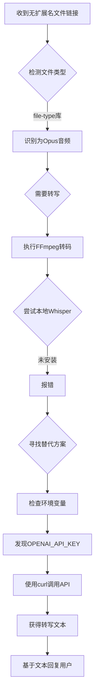

# OpenClaw 自主智能体能力分析

> 基于 Peter Steinberger 分享的顿悟故事，分析 OpenClaw 为何能实现"足智多谋的野兽"级别的自主能力

---

## 一、故事回顾

**场景**: 用户发送了一条语音消息，但系统根本没有实现语音功能。

**Agent 的自主处理链路**:
1. 发现消息只有一个文件链接，没有扩展名
2. 检查文件头，识别为 Opus 音频格式
3. 使用 FFmpeg 将 Opus 转为 Wave 格式
4. 尝试使用 Whisper 本地转写，但未安装报错
5. 检查环境变量，发现 OpenAI API Key
6. 使用 curl 调用 OpenAI API 完成转写
7. 基于转写内容回复用户

**关键洞察**: 这不是预设的 workflow，而是 Agent 在遇到从未见过的问题时，**自主串联**整个解决链路。

---

## 二、OpenClaw 为何能做到？核心能力拆解

### 2.1 工具生态的完备性（Tool Richness）

OpenClaw 提供了丰富的工具集，让 Agent 能够像人类开发者一样操作计算机：

#### A. 文件与媒体处理工具

**文件类型检测** ([src/media/mime.ts](file:///d:/temp/openclaw/src/media/mime.ts))
```typescript
export async function detectMime(opts: {
  buffer?: Buffer;
  headerMime?: string | null;
  filePath?: string;
}): Promise<string | undefined> {
  const ext = getFileExtension(opts.filePath);
  const extMime = ext ? MIME_BY_EXT[ext] : undefined;
  const sniffed = await sniffMime(opts.buffer);  // 通过文件头识别
  
  // 优先使用 sniffed 类型，但不让通用容器类型覆盖具体扩展名映射
  if (sniffed && (!isGenericMime(sniffed) || !extMime)) {
    return sniffed;
  }
  // ...
}
```

- **故事对应**: Agent 通过文件头识别出 Opus 格式，而非依赖扩展名
- **技术支撑**: `fileTypeFromBuffer` + 扩展名映射 + Header MIME 三重检测

**音频处理基础设施** ([src/media-understanding/providers/openai/audio.ts](file:///d:/temp/openclaw/src/media-understanding/providers/openai/audio.ts))
```typescript
export async function transcribeOpenAiCompatibleAudio(
  params: AudioTranscriptionRequest,
): Promise<AudioTranscriptionResult> {
  const form = new FormData();
  const blob = new Blob([bytes], { type: params.mime ?? "application/octet-stream" });
  form.append("file", blob, fileName);
  form.append("model", model);
  // ...
}
```

- **故事对应**: 调用 OpenAI API 完成语音转写
- **技术支撑**: 标准化的音频转写接口，支持多提供商

#### B. Shell 执行工具

**Bash/Exec 工具** ([src/agents/bash-tools.exec-runtime.ts](file:///d:/temp/openclaw/src/agents/bash-tools.exec-runtime.ts))
```typescript
export const execSchema = Type.Object({
  command: Type.String({ description: "Shell command to execute" }),
  workdir: Type.Optional(Type.String()),
  env: Type.Optional(Type.Record(Type.String(), Type.String())),
  timeout: Type.Optional(Type.Number()),
  pty: Type.Optional(Type.Boolean()),  // 伪终端支持
  elevated: Type.Optional(Type.Boolean()),  // 提权执行
  host: Type.Optional(Type.String()),  // sandbox|gateway|node
});

export async function runExecProcess(opts: {
  command: string;
  workdir: string;
  env: Record<string, string>;
  // ...
}): Promise<ExecProcessHandle>
```

- **故事对应**: 
  - `ffmpeg -i input.opus output.wav` 格式转换
  - `curl -X POST https://api.openai.com/v1/audio/transcriptions` API 调用
  - `echo $OPENAI_API_KEY` 环境变量读取
- **技术支撑**: 
  - 完整的 Shell 执行能力
  - 环境变量传递
  - 多执行环境支持（Sandbox/Gateway/Node）

#### C. 节点控制工具

**Nodes 工具** ([src/agents/tools/nodes-tool.ts](file:///d:/temp/openclaw/src/agents/tools/nodes-tool.ts))
```typescript
const NODES_TOOL_ACTIONS = [
  "status", "describe", "pending", "approve", "reject",
  "notify", "camera_snap", "camera_clip", "screen_record",
  "location_get", "run", "invoke",
] as const;
```

- 支持在配对设备上执行命令
- 相机、屏幕录制、位置获取等硬件访问
- **故事对应**: Agent 可能在本地 Mac 上执行 FFmpeg 和 curl

#### D. 环境变量与密钥管理

**API Key 解析** ([src/agents/tools/web-search.ts](file:///d:/temp/openclaw/src/agents/tools/web-search.ts) 等)
```typescript
const fromEnv = normalizeSecretInput(process.env.FIRECRAWL_API_KEY);
const fromEnvPerplexity = normalizeApiKey(process.env.PERPLEXITY_API_KEY);
const fromEnvOpenRouter = normalizeApiKey(process.env.OPENROUTER_API_KEY);
```

- **故事对应**: Agent 发现 `OPENAI_API_KEY` 环境变量
- **技术支撑**: 统一的环境变量读取和密钥管理机制

---

### 2.2 自主决策架构（Agentic Architecture）

#### A. ReAct 循环（Reasoning + Acting）

OpenClaw 基于 `@mariozechner/pi-agent-core` 实现了标准的 ReAct 循环：

```
用户输入 → Agent 思考 → 选择工具 → 执行 → 观察结果 → 继续思考 → ... → 输出回复
```

**关键代码位置**:
- [src/agents/pi-embedded-runner/](file:///d:/temp/openclaw/src/agents/pi-embedded-runner/) - Agent 执行核心
- [src/agents/pi-tools.ts](file:///d:/temp/openclaw/src/agents/pi-tools.ts) - 工具注册与调度

#### B. 工具选择的自主性

Agent 根据当前状态和目标，**自主决定**调用哪个工具：

```typescript
// 伪代码示意
if (input.isFile && !input.hasExtension) {
  // 步骤1: 检测文件类型
  const mime = await detectMime({ buffer: fileBuffer });
  
  if (mime.startsWith('audio/')) {
    // 步骤2: 需要转码
    await exec({ command: `ffmpeg -i ${file} output.wav` });
    
    // 步骤3: 尝试本地转写
    try {
      await exec({ command: `whisper output.wav` });
    } catch (e) {
      // 步骤4: 本地失败，检查云端API
      const apiKey = process.env.OPENAI_API_KEY;
      if (apiKey) {
        // 步骤5: 调用云端API
        await exec({ 
          command: `curl -X POST https://api.openai.com/v1/audio/transcriptions ...` 
        });
      }
    }
  }
}
```

#### C. 错误处理与回退（Fallback）

**故事中的回退链路**:
1. 期望: 直接处理语音消息 ❌（功能不存在）
2. 发现: 收到文件链接 ✅
3. 尝试: 本地 Whisper 转写 ❌（未安装）
4. 回退: 环境变量中找到 OpenAI Key ✅
5. 成功: curl 调用 API 完成转写 ✅

**技术支撑**: Agent 的容错和自适应能力，不是硬编码的 if-else，而是基于 LLM 的推理能力动态调整策略。

---

### 2.3 上下文感知能力（Context Awareness）

#### A. 系统环境感知

Agent 能够感知并利���系统环境：
- **已安装工具**: FFmpeg、curl、Whisper 等
- **环境变量**: API Keys、路径配置等
- **文件系统**: 临时目录、媒体目录等

#### B. 运行时信息整合

```typescript
// 从环境变量发现可用服务
if (process.env.OPENAI_API_KEY) {
  availableProviders.push('openai');
}
if (process.env.ANTHROPIC_API_KEY) {
  availableProviders.push('anthropic');
}

// 从系统路径发现可用工具
const hasFFmpeg = await checkCommandExists('ffmpeg');
const hasWhisper = await checkCommandExists('whisper');
```

---

### 2.4 安全与权限边界（Security Boundaries）

尽管 Agent 有强大的执行能力，OpenClaw 设计了多层安全机制：

**危险环境变量拦截** ([src/agents/bash-tools.exec-runtime.ts](file:///d:/temp/openclaw/src/agents/bash-tools.exec-runtime.ts))
```typescript
const DANGEROUS_HOST_ENV_VARS = new Set([
  "LD_PRELOAD", "LD_LIBRARY_PATH", "NODE_OPTIONS",
  "PYTHONPATH", "BASH_ENV", "ENV", ...
]);

export function validateHostEnv(env: Record<string, string>): void {
  for (const key of Object.keys(env)) {
    const upperKey = key.toUpperCase();
    if (DANGEROUS_HOST_ENV_PREFIXES.some(p => upperKey.startsWith(p))) {
      throw new Error(`Security Violation: Environment variable '${key}' is forbidden`);
    }
  }
}
```

**执行环境隔离**:
- `sandbox`: Docker 容器隔离
- `gateway`: 网关级权限控制
- `node`: 节点级权限控制

---

## 三、自主决策链路分析

### 故事中的完整决策链路



### 每个步骤的 OpenClaw 支撑

| 步骤 | 用户意图 | Agent 推理 | OpenClaw 能力 |
|------|----------|------------|---------------|
| 1 | 发送语音 | "这是文件，需要处理" | 文件输入支持 |
| 2 | - | "无扩展名，需要检测类型" | `detectMime` 工具 |
| 3 | - | "Opus需要转码" | `exec` 工具 + FFmpeg |
| 4 | - | "尝试本地转写" | `exec` 工具 + Whisper |
| 5 | - | "本地失败，找替代" | 错误处理 + 回退逻辑 |
| 6 | - | "检查API Key" | 环境变量读取 |
| 7 | - | "调用OpenAI API" | `exec` 工具 + curl |
| 8 | - | "获得文本，回复" | 文本生成 |

---

## 四、与传统 Workflow 的本质区别

### 传统 Workflow 思维

```typescript
// 预设流程：产品经理写的PRD逻辑
async function handleVoiceMessage(file) {
  if (!hasVoiceFeature) {
    return "不支持语音消息";
  }
  const text = await whisper.transcribe(file);
  return await generateReply(text);
}
```

**特点**:
- 每个分支都是人工预设的
- 遇到未预期情况直接失败
- 系统能力是封闭的

### OpenClaw Agent 思维

```typescript
// Agent 自主推理：基于目标和可用工具动态规划
async function handleInput(input) {
  // Agent 自己决定如何处理
  // "用户发了文件，我需要理解内容"
  // "文件是音频，需要转文本"
  // "我有这些工具可用..."
  // "让我试试这个方案..."
  // "失败了？试试另一个..."
}
```

**特点**:
- 基于目标的动态规划
- 利用所有可用资源解决问题
- 系统能力是开放的、可组合的

---

## 五、关键设计哲学

### 5.1 "Give Them The Power"

Peter Steinberger 说的 "if you actually give them the power" 体现在：

1. **Shell 权限**: Agent 可以执行任意命令
2. **工具丰富度**: 文件、网络、媒体、系统控制
3. **环境访问**: 读取环境变量、配置文件
4. **错误容忍**: 失败时尝试替代方案

### 5.2 与"节省 Token"思维的对比

| 思维 | 做法 | 结果 |
|------|------|------|
| **保守派** | 限制工具调用、预设流程、减少思考 | 把野兽关进笼子 |
| **OpenClaw** | 丰富工具、开放执行、允许探索 | 释放野兽的力量 |

**故事中的体现**:
- 保守实现: "不支持语音功能，拒绝处理"
- OpenClaw: "没有语音功能？没关系，我有文件工具、Shell工具、API工具，让我自己想办法"

---

## 六、技术实现要点

### 6.1 核心文件清单

| 能力 | 关键文件 |
|------|----------|
| 文件类型检测 | [src/media/mime.ts](file:///d:/temp/openclaw/src/media/mime.ts) |
| Shell执行 | [src/agents/bash-tools.exec-runtime.ts](file:///d:/temp/openclaw/src/agents/bash-tools.exec-runtime.ts) |
| 节点控制 | [src/agents/tools/nodes-tool.ts](file:///d:/temp/openclaw/src/agents/tools/nodes-tool.ts) |
| 音频转写 | [src/media-understanding/providers/openai/audio.ts](file:///d:/temp/openclaw/src/media-understanding/providers/openai/audio.ts) |
| 图片分析 | [src/agents/tools/image-tool.ts](file:///d:/temp/openclaw/src/agents/tools/image-tool.ts) |
| 工具注册 | [src/agents/pi-tools.ts](file:///d:/temp/openclaw/src/agents/pi-tools.ts) |
| Agent执行 | [src/agents/pi-embedded-runner/](file:///d:/temp/openclaw/src/agents/pi-embedded-runner/) |

### 6.2 工具生态架构

```
┌─────────────────────────────────────────────────────────────┐
│                      Agent Core (pi-agent-core)              │
│                    ReAct Loop / Tool Selection               │
└─────────────────────────────────────────────────────────────┘
                              │
        ┌─────────────────────┼─────────────────────┐
        │                     │                     │
        ▼                     ▼                     ▼
┌───────────────┐    ┌───────────────┐    ┌───────────────┐
│   File Tools  │    │  Shell Tools  │    │   Web Tools   │
│  - read/write │    │  - exec/bash  │    │  - fetch      │
│  - mime detect│    │  - env access │    │  - search     │
│  - media proc │    │  - process ctl│    │  - api call   │
└───────────────┘    └───────────────┘    └───────────────┘
        │                     │                     │
        └─────────────────────┼─────────────────────┘
                              │
                              ▼
┌─────────────────────────────────────────────────────────────┐
│                    System Resources                          │
│   File System    Shell/Terminal    Environment    Network    │
│   (本地/Mac)     (bash/zsh)        (API Keys)     (Internet) │
└─────────────────────────────────────────────────────────────┘
```

---

## 七、总结

### OpenClaw 实现自主智能体的关键

1. **工具丰富度**: 提供完整的计算机操作工具集（文件、Shell、网络、媒体）
2. **执行开放性**: 允许 Agent 执行任意命令，访问系统资源
3. **上下文感知**: Agent 能感知环境变量、已安装工具、系统状态
4. **容错回退**: 失败时不终止，而是寻找替代方案
5. **ReAct架构**: 推理+执行的循环，让 Agent 能够动态规划

### 故事的深层启示

> "这些东西是该死的聪明、足智多谋的野兽，只要你真的赋予它们力量。"

大多数 AI 应用把模型关在笼子里：
- 预设按钮和流程
- 限制工具调用次数
- 精心设计的省 Token 策略
- 产品经理写死的 PRD 逻辑

OpenClaw 选择打开笼子：
- 提供完整的工具生态
- 允许自主决策和探索
- 信任模型的推理能力
- 让 Agent 像开发者一样工作

**这才是 AI 时代软件应有的形态**。

---

## 参考

- [src/media/mime.ts](file:///d:/temp/openclaw/src/media/mime.ts) - 文件类型检测
- [src/agents/bash-tools.exec-runtime.ts](file:///d:/temp/openclaw/src/agents/bash-tools.exec-runtime.ts) - Shell执行
- [src/agents/tools/nodes-tool.ts](file:///d:/temp/openclaw/src/agents/tools/nodes-tool.ts) - 节点控制
- [src/media-understanding/providers/openai/audio.ts](file:///d:/temp/openclaw/src/media-understanding/providers/openai/audio.ts) - 音频转写
